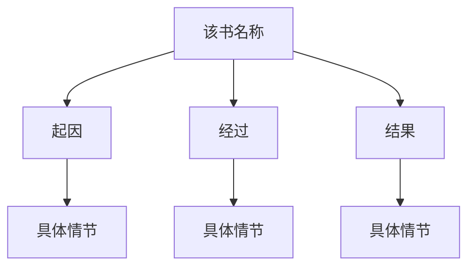

# 好用的写作模板，不用头疼怎么排版啦！
这里记录常用到的一些写作模板 
 
## 读书笔记模板
# 读书笔记

### 一、作者简介

> 搜集该书作者的相关资料

:::info

作者：该书作者是谁……

作者生平：该书作者的生平……

:::

### 二、故事背景

> 了解该书的故事背景/创作背景

<table style="font-size:5px;">
	<tr style="height:40px;">
		  <th  style="text-align:center;">地点</th>
          <td  style="text-align:center;">xx</td>
	</tr >
	<tr style="height:40px;">
		  <th  style="text-align:center;">时间</th>
          <td  style="text-align:center;">xxxxxxxxx</td>
	</tr >
	<tr style="height:40px;">
		  <th  style="text-align:center;">社会背景</th>
          <td>1.xxxxxxx；2.xxxxxxxx；3.xxxxxxxxxxxx</td>		
	</tr >		
</table>

### 三、经典名句

> 摘录书中的一些喜欢的经典名句

:::info

* 该书的经典名句摘录…

*  该书的经典名句摘录…

* 该书的经典名句摘录…

* 该书的经典名句摘录…

* 该书的经典名句摘录…

:::

### 四、故事结构

> 梳理该书的基本结构
    

### 五、人物简介

> 梳理书中主要人物的具体事迹，理清人物之间的关系

:::info

1. 该书的主要人物xxx
该人物具体事迹：xxxxxxxxxx

2. 该书的主要人物xxx
该人物具体事迹：xxxxxxxxxx

3. 该书的主要人物xxx
该人物具体事迹：xxxxxxxxxx

4. 该书的主要人物xxx
该人物具体事迹：xxxxxxxxxx
……

:::

### 六、艺术成就

> 总结记录下该书所取得的艺术成就

……

### 七、书评

> 可以说一说读完该书后，对它的评价/感受

:::info

……

:::

## 年度自我提升计划模板
# 
年度自我提升计划

### 一、每月阅读1本书
>读书是一种主动的过程，可帮助我们开阔视野、扩展知识、提升思维与思考能力，让大脑活跃起来。

#### 
阅读清单

<!--这是表格样式的内容-->

<!--这是阅读清单表格部分的内容-->
|         阅读情况         |                  阅读清单                  |         阅读情况         |                阅读清单                |
|:------------------------:|:------------------------------------------:|:------------------------:|:--------------------------------------:|
| √ | 《如何阅读一本书》 | √ |  《百年孤独》  |
| √ |    《小狗钱钱》    | √ | 《沟通的艺术》 |
| × |   《非暴力沟通》   | × |  《时间简史》  |
| × |   《金字塔原理》   | × |    《原则》    |
| × |  《富爸爸穷爸爸》  | × |   《厚黑学》   |
| × |     《理想国》     | × |  《孙子兵法》  |

 

### 二、每月看一场辩论类节目
>辩论类娱乐节目不仅可用于平时娱乐，还能够为我们提供一些新的看法与价值观，从中学习到一些不一样的东西，娱乐的同时引发思考，还能在一定程度上提升思考能力。

#### 
分类节目

    
|         观看情况         |                  观看主题                  |        观看情况         |                观看主题                |
|:------------------------:|:------------------------------------------:|:------------------------:|:--------------------------------------:|
| √ | 《时间管理》 | √ |  《心态调整》  |
| √ |    《制定计划》    | √ | 《读书学习》 |
| × |   《自我提升》   | × |  《工作职场》  |
| × |   《沟通技巧》   | × |    《生活习惯》    |
| × |  《关于选择》  | × |   《关于心理》   |
| × |     《关于成长》     | × |  《关于目标》  |

 

### 三、每月观看一部高分纪录片
>通过纪录片可以开阔视野、还原本真，去见识宇宙的辽阔的同事看尽世间繁华与人间百态，同时还能了解历史，通过纪录片看到各领域的百花齐放与历史真相。

#### 
纪录片节目

|         观看情况         |                  观看主题                   |         观看情况         |                  观看主题                   |
|:------------------------:|:-------------------------------------------:|:------------------------:|:-------------------------------------------:|
| √ |  《复活的军团》  | √ |   《河西走廊》   |
| √ |   《中国通史》   | √ |   《航拍中国》   |
| × |  《生命的奇迹》  | × |     《行星》     |
| × |  《宇宙的奇迹》  | × | 《宇宙时空之旅》 |
| × | 《舌尖上的中国》 | × |   《蓝色星球》   |
| × |     《王朝》     | × |     《家园》     |

 

### 四、每月观看一部高分电影
>观看高分电影可在疲惫的时候放松自己，同时还能从中获得一些感悟和审美体验，甚至通过高分电影洗涤心灵。
    
#### 
高分电影

    
|         观看情况         |                  观看主题                   |         观看情况         |                  观看主题                   |
|:------------------------:|:-------------------------------------------:|:------------------------:|:-------------------------------------------:|
| √ |  《霸王别姬》  | √ |   《阿凡达》   |
| √ |   《阿甘正传》   | √ |   《肖申克的救赎》   |
| × |  《美丽人生》  | × |     《活着》     |
| × |  《十二怒汉》  | × | 《鬼子来了》 |
| × | 《让子弹飞》 | × |   《天空之城》   |
| × |     《黑客帝国》     | × |     《美丽心灵》     |

## 每日打卡计划模板
### 一、每日打卡计划表模板
>可通过给markdown添加表格的方式制作每日打卡计划表

<table>
    <tr>
        <td  colspan="7" style="text-align:center;background:#f8b4b4;height:50px;color:#fff;font-size:25px;">每日打卡计划表</td>
    </tr>
    <tr>
        <th style="text-align:center;height:40px;font-size:20px;">日期/事项</th>
		<th style="text-align:center;height:40px;">事项1</th>
		<th style="text-align:center;height:40px;">事项2</th>
		<th style="text-align:center;height:40px;">事项3</th>
		<th style="text-align:center;height:40px;">事项4</th>
		<th style="text-align:center;height:40px;">事项5</th>
		<th style="text-align:center;height:40px;">事项6</th>
    </tr>
	    <tr>
        <th style="text-align:center;height:40px;">星期一</th>
		<td style="text-align:center;height:40px;"></td>
		<td style="text-align:center;height:40px;"></td>
		<td style="text-align:center;height:40px;"></td>
		<td style="text-align:center;height:40px;"></td>
		<td style="text-align:center;height:40px;"></td>
		<td style="text-align:center;height:40px;"></td>
    </tr>
	    <tr>
        <th style="text-align:center;height:40px;">星期二</th>
		<td style="text-align:center;height:40px;"></td>
		<td style="text-align:center;height:40px;"></td>
		<td style="text-align:center;height:40px;"></td>
		<td style="text-align:center;height:40px;"></td>
		<td style="text-align:center;height:40px;"></td>
		<td style="text-align:center;height:40px;"></td>
    </tr>
	    <tr>
        <th style="text-align:center;height:40px;">星期三</th>
		<td style="text-align:center;height:40px;"></td>
		<td style="text-align:center;height:40px;"></td>
		<td style="text-align:center;height:40px;"></td>
		<td style="text-align:center;height:40px;"></td>
		<td style="text-align:center;height:40px;"></td>
		<td style="text-align:center;height:40px;"></td>
    </tr>
	    <tr>
        <th style="text-align:center;height:40px;">星期四</th>
		<td style="text-align:center;height:40px;"></td>
		<td style="text-align:center;height:40px;"></td>
		<td style="text-align:center;height:40px;"></td>
		<td style="text-align:center;height:40px;"></td>
		<td style="text-align:center;height:40px;"></td>
		<td style="text-align:center;height:40px;"></td>
    </tr>
	    <tr>
        <th style="text-align:center;height:40px;">星期五</th>
		<td style="text-align:center;height:40px;"></td>
		<td style="text-align:center;height:40px;"></td>
		<td style="text-align:center;height:40px;"></td>
		<td style="text-align:center;height:40px;"></td>
		<td style="text-align:center;height:40px;"></td>
		<td style="text-align:center;height:40px;"></td>
    </tr>
	    <tr>
        <th style="text-align:center;height:40px;">星期六</th>
		<td style="text-align:center;height:40px;"></td>
		<td style="text-align:center;height:40px;"></td>
		<td style="text-align:center;height:40px;"></td>
		<td style="text-align:center;height:40px;"></td>
		<td style="text-align:center;height:40px;"></td>
		<td style="text-align:center;height:40px;"></td>
    </tr>
	    <tr>
        <th style="text-align:center;height:40px;">星期日</th>
		<td style="text-align:center;height:40px;"></td>
		<td style="text-align:center;height:40px;"></td>
		<td style="text-align:center;height:40px;"></td>
		<td style="text-align:center;height:40px;"></td>
		<td style="text-align:center;height:40px;"></td>
		<td style="text-align:center;height:40px;"></td>
    </tr>
</table>

### 二、每日计划表案例
>利用markdown制作每日打卡计划表的案例分享

<table>
    <tr>
        <td  colspan="7" style="text-align:center;background:#f8b4b4;height:50px;color:#fff;font-size:25px;">每日打卡计划表</td>
    </tr>
    <tr>
        <th style="text-align:center;height:40px;font-size:20px;">日期/事项</th>
		<th style="text-align:center;height:40px;">早睡早起</th>
		<th style="text-align:center;height:40px;">晨跑半小时</th>
		<th style="text-align:center;height:40px;">规律三餐</th>
		<th style="text-align:center;height:40px;">健身一小时</th>
		<th style="text-align:center;height:40px;">午休半小时</th>
		<th style="text-align:center;height:40px;">阅读一小时</th>
    </tr>
	    <tr>
        <th style="text-align:center;height:40px;">星期一</th>
		<td style="text-align:center;height:40px;color:red;font-size:20px;">√</td>
		<td style="text-align:center;height:40px;color:red;font-size:20px;">√</td>
		<td style="text-align:center;height:40px;color:red;font-size:20px;">√</td>
		<td style="text-align:center;height:40px;color:red;font-size:20px;">√</td>
		<td style="text-align:center;height:40px;color:red;font-size:20px;">√</td>
		<td style="text-align:center;height:40px;color:red;font-size:20px;">√</td>
    </tr>
	    <tr>
        <th style="text-align:center;height:40px;">星期二</th>
		<td style="text-align:center;height:40px;color:red;font-size:20px;">√</td>
		<td style="text-align:center;height:40px;color:red;font-size:20px;">√</td>
		<td style="text-align:center;height:40px;color:red;font-size:20px;">√</td>
		<td style="text-align:center;height:40px;"></td>
		<td style="text-align:center;height:40px;color:red;font-size:20px;">√</td>
		<td style="text-align:center;height:40px;color:red;font-size:20px;">√</td>
    </tr>
	    <tr>
        <th style="text-align:center;height:40px;">星期三</th>
		<td style="text-align:center;height:40px;color:red;font-size:20px;">√</td>
		<td style="text-align:center;height:40px;color:red;font-size:20px;">√</td>
		<td style="text-align:center;height:40px;"></td>
		<td style="text-align:center;height:40px;"></td>
		<td style="text-align:center;height:40px;"></td>
		<td style="text-align:center;height:40px;color:red;font-size:20px;">√</td>
    </tr>
	    <tr>
        <th style="text-align:center;height:40px;">星期四</th>
		<td style="text-align:center;height:40px;color:red;font-size:20px;">√</td>
		<td style="text-align:center;height:40px;color:red;font-size:20px;">√</td>
		<td style="text-align:center;height:40px;"></td>
		<td style="text-align:center;height:40px;"></td>
		<td style="text-align:center;height:40px;"></td>
		<td style="text-align:center;height:40px;color:red;font-size:20px;">√</td>
    </tr>
	    <tr>
        <th style="text-align:center;height:40px;">星期五</th>
		<td style="text-align:center;height:40px;color:red;font-size:20px;">√</td>
		<td style="text-align:center;height:40px;"></td>
		<td style="text-align:center;height:40px;"></td>
		<td style="text-align:center;height:40px;"></td>
		<td style="text-align:center;height:40px;color:red;font-size:20px;">√</td>
		<td style="text-align:center;height:40px;"></td>
    </tr>
	    <tr>
        <th style="text-align:center;height:40px;">星期六</th>
		<td style="text-align:center;height:40px;"></td>
		<td style="text-align:center;height:40px;color:red;font-size:20px;">√</td>
		<td style="text-align:center;height:40px;color:red;font-size:20px;">√</td>
		<td style="text-align:center;height:40px;color:red;font-size:20px;">√</td>
		<td style="text-align:center;height:40px;"></td>
		<td style="text-align:center;height:40px;"></td>
    </tr>
	    <tr>
        <th style="text-align:center;height:40px;">星期日</th>
		<td style="text-align:center;height:40px;"></td>
		<td style="text-align:center;height:40px;color:red;font-size:20px;">√</td>
		<td style="text-align:center;height:40px;color:red;font-size:20px;">√</td>
		<td style="text-align:center;height:40px;color:red;font-size:20px;">√</td>
		<td style="text-align:center;height:40px;"></td>
		<td style="text-align:center;height:40px;color:red;font-size:20px;">√</td>
    </tr>
</table>